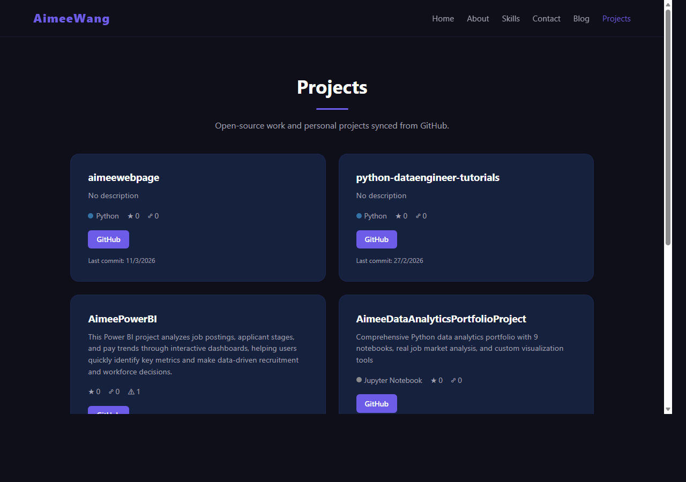
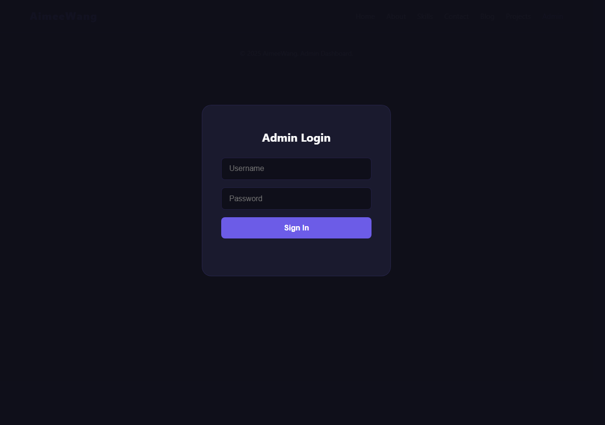

# Aimee's Portfolio Website

A full-stack personal portfolio website with admin dashboard, visitor analytics, blog CMS, GitHub project showcase, click tracking, contact form, and email notifications.

**Live Site:** https://aimeelan.azurewebsites.net

## Screenshots

| Visitor Verification | Blog |
|:---:|:---:|
|  |  |

| GitHub Projects | Admin Dashboard |
|:---:|:---:|
|  |  |

## Tech Stack

| Layer | Technology | Purpose |
|-------|-----------|---------|
| Backend | Python Flask | Web framework, API routes, session management |
| Database | Azure PostgreSQL Flexible Server | Persistent data: visitors, analytics, blog posts, projects |
| Cache | Azure Cache for Redis | Cache stats, blog posts, reduce DB queries |
| Frontend | HTML / CSS / JavaScript | Dark-theme portfolio UI with Chart.js dashboards |
| Hosting | Azure App Service (Linux) | Production hosting with managed SSL |
| CI/CD | GitHub Actions | Auto build & deploy on `git push` |
| Email | Gmail SMTP | Notify site owner when visitors send messages |
| External API | GitHub REST API v3 | Sync repos for project showcase |

## Project Structure

```
my-website/
├── app.py                  # Flask backend (all API routes, DB, auth)
├── seed_data.py            # Blog seed posts (loaded on first startup)
├── requirements.txt        # Python dependencies (version-pinned)
├── .env.example            # Environment variable template
├── .gitignore
├── LICENSE
├── README.md
├── static/
│   ├── verify.html         # Entry gate — name + email verification
│   ├── index.html          # Main portfolio page (after verification)
│   ├── blog.html           # Blog listing with tag filtering & pagination
│   ├── post.html           # Individual blog post (Markdown + code highlight)
│   ├── projects.html       # GitHub project showcase
│   ├── admin.html          # Admin dashboard (login, charts, tables, export)
│   ├── style.css           # Dark theme with purple accents
│   └── script.js           # Click tracking, pageview tracking, animations
├── tests/
│   └── test_app.py         # 50 unit tests (email, auth, routes, cache, parsers)
├── docs/                   # All project documentation (10 files)
│   ├── ARCHITECTURE.md     # System design, DB schema, security, data flow
│   ├── FLASK.md            # All 22 routes, decorators, request flow
│   ├── DEPLOYMENT.md       # CI/CD pipeline, GitHub Actions, Azure deploy
│   ├── POSTGRESQL.md       # Database schema, SQL operations, monitoring
│   ├── REDIS.md            # Cache strategy, admin panel, Azure Redis
│   ├── TROUBLESHOOTING.md  # Issues & solutions encountered in development
│   ├── STORY.md            # Full project journey narrative
│   ├── HOW_TO_DEPLOY.md    # 5 deployment methods (local, Railway, Azure...)
│   ├── BACKUP_AND_MIGRATION.md  # Backup guide & platform migration
│   └── AZURE_SETUP_GUIDE.md    # Step-by-step Azure Portal setup tutorial
├── screenshots/            # Website screenshots for README
└── .github/
    └── workflows/
        └── main_aimeelan.yml   # GitHub Actions CI/CD pipeline
```

## Features

### Core
- **Visitor Verification** — Visitors must enter name + email before viewing the portfolio
- **Anti-Phishing** — Disposable/temporary email domains are blocked
- **Click Tracking** — Every `data-track` click is logged with visitor ID and page
- **Contact Form** — Messages saved to DB + email notification to owner

### Admin Dashboard (`/admin`)
- **Secure Login** — bcrypt password hashing, session-based auth
- **KPI Cards** — Visitors, page views, clicks, messages, blog post counts, Redis cache status
- **Redis Cache Panel** — Live connection status, memory usage, peak memory, total cached keys, and a table of all 6 cached endpoints with key patterns, TTLs, and descriptions
- **Charts** — Visitors/day, pageviews/day, top clicks, device breakdown, email domains, top pages (Chart.js)
- **Visitor List** — Pagination, domain filtering
- **Retention Cohorts** — Day 0/1/7/30 retention analysis with SQL CTEs
- **CSV Export** — Download visitors, clicks, messages, page views as CSV
- **GitHub Sync** — One-click sync of repos from GitHub API

### Visitor Analytics
- **Page View Tracking** — Page, referrer, user-agent, IP hash, screen width, duration
- **Session Management** — Tracks visitor sessions with page count and timestamps
- **Device Classification** — Mobile / Tablet / Desktop based on screen width

### Blog CMS (`/blog`)
- **5 Seed Posts** — Azure AI Support, Python diagnostic tools, PostgreSQL optimization, Azure networking, career growth
- **Markdown Rendering** — Using marked.js with highlight.js code syntax highlighting
- **Tag Filtering** — Filter posts by tags (Azure, AI, Python, SQL, etc.)
- **Pagination** — Server-side pagination with configurable page size
- **View Counter** — Auto-increments on each post view

### GitHub Projects (`/projects`)
- **GitHub API Integration** — Sync repos via `/api/projects/sync`
- **Project Cards** — Name, description, language, stars, forks, issues
- **Featured Projects** — Highlight featured repos
- **Live Demo Links** — Shows homepage URL if set on GitHub

## API Endpoints

| Method | Path | Auth | Description |
|--------|------|------|-------------|
| GET | `/` | — | Serves verify.html or index.html based on session |
| GET | `/blog` | — | Blog listing page |
| GET | `/blog/<slug>` | — | Individual blog post page |
| GET | `/projects` | — | GitHub projects showcase page |
| GET | `/admin` | — | Admin dashboard page |
| POST | `/api/verify` | — | Verify visitor (name + email) |
| POST | `/api/pageview` | — | Record a page view with analytics data |
| POST | `/api/track` | Verified | Log a click event |
| POST | `/api/contact` | Verified | Send a message to site owner |
| GET | `/api/posts` | — | List blog posts (supports `?tag=`, `?page=`, `?per_page=`) |
| GET | `/api/posts/<slug>` | — | Get single post with full Markdown content |
| GET | `/api/tags` | — | List all tags with post counts |
| GET | `/api/projects` | — | List all synced GitHub projects |
| POST | `/api/projects/sync` | Admin | Sync repos from GitHub API |
| POST | `/api/admin/login` | — | Admin login (bcrypt) |
| POST | `/api/admin/logout` | — | Admin logout |
| GET | `/api/admin/stats` | Admin | Full analytics dashboard data + Redis server info |
| GET | `/api/admin/visitors` | Admin | Paginated visitor list with domain filter |
| GET | `/api/admin/export/<table>` | Admin | CSV export (visitors, click_logs, messages, page_views) |
| GET | `/api/admin/retention` | Admin | Retention cohort analysis |

## Database Tables

| Table | Purpose |
|-------|---------|
| `visitors` | Verified visitors (name, email, token) |
| `click_logs` | Click tracking events |
| `messages` | Contact form messages |
| `page_views` | Page view analytics (page, referrer, UA, IP hash, duration, screen width) |
| `visitor_sessions` | Session lifecycle (start, end, page count) |
| `posts` | Blog posts (slug, title, summary, Markdown content, views) |
| `tags` | Blog tags |
| `post_tags` | Many-to-many: posts ↔ tags |
| `projects` | GitHub repos (name, description, language, stars, forks, featured) |

## Quick Start (Local Development)

```bash
# 1. Clone
git clone https://github.com/hahAI111/aimeewebpage.git
cd aimeewebpage

# 2. Copy environment template and edit
cp .env.example .env
# Edit .env with your PostgreSQL connection string (at minimum)

# 3. Install dependencies
pip install -r requirements.txt

# 4. Run (uses local PostgreSQL by default)
python app.py
# → http://localhost:5000
```

## Running Tests

```bash
pip install pytest
python -m pytest tests/ -v
```

50 tests covering: email validation, IP hashing, connection string parsing, cache helpers, seed data integrity, Flask routes, auth, and pageview tracking.

## Environment Variables

| Variable | Description |
|----------|-------------|
| `AZURE_POSTGRESQL_CONNECTIONSTRING` | PostgreSQL connection string |
| `AZURE_REDIS_CONNECTIONSTRING` | Redis connection string (optional — app works without it) |
| `OWNER_EMAIL` | Email to receive contact notifications |
| `SMTP_SERVER` / `SMTP_PORT` / `SMTP_USER` / `SMTP_PASS` | Gmail SMTP config |
| `SECRET_KEY` | Flask session encryption key |
| `ADMIN_USER` | Admin username (default: `admin`) |
| `ADMIN_PASS` or `ADMIN_PASS_HASH` | Admin password (plain or bcrypt hash) |
| `GITHUB_USERNAME` | GitHub user for project sync (default: `hahAI111`) |
| `GITHUB_TOKEN` | GitHub personal access token (optional, raises API rate limit) |
| `GITHUB_SYNC_INTERVAL` | Auto-sync interval in seconds (default: `21600` = 6 hours) |

## Deployment

Code is auto-deployed via GitHub Actions. Just push to `main`:

```bash
git add -A
git commit -m "your change"
git push
```

GitHub Actions will build and deploy to Azure App Service automatically.

## How to Use

### Visitor Flow

1. Open https://aimeelan.azurewebsites.net
2. Enter your **name** and **email** on the verification page
3. After verification, browse the portfolio, blog, and projects pages
4. Use the **Contact** form at the bottom to send a message

### Admin Dashboard

1. Open https://aimeelan.azurewebsites.net/admin
2. Login with admin credentials (set via `ADMIN_USER` / `ADMIN_PASS` env vars)
3. The dashboard shows:
   - **KPI Cards** — Total visitors, page views, clicks, messages, blog posts
   - **Redis Cache KPI** — Shows ✅ Connected (green) or ❌ Not Connected (gray) at a glance
   - **Charts** — Visitors per day, pageviews per day, top clicked elements, device types, email domains
   - **Top Pages & Posts** — Most viewed pages and blog posts
   - **Recent Messages** — Latest messages from the contact form
   - **Visitor List** — Paginated table with domain filtering
   - **Retention Cohorts** — Day 0/1/7/30 visitor retention analysis
4. **CSV Export** — Click "Export" buttons to download visitors, clicks, messages, or pageviews as CSV
5. **GitHub Sync** — Click "Sync Projects" to pull latest repos from GitHub API

### Admin — Redis Cache Panel

When Redis is connected, a **Redis Cache Status** panel appears below the KPI cards showing:

| Metric | Description |
|--------|-------------|
| **Status** | ✅ Connected (green) or ❌ Not Connected (gray) |
| **Memory Used** | Current Redis memory consumption (e.g. `357.72K`) |
| **Peak Memory** | Highest memory usage since Redis started (e.g. `559.67K`) |
| **Total Keys** | Number of active cached keys in Redis |

Below the metrics is a **Cached Endpoints** table listing all 6 cache keys:

| Key Pattern | TTL | What It Caches |
|-------------|-----|----------------|
| `stats:overview` | 60s | Admin dashboard KPIs & charts |
| `stats:retention` | 300s | Retention cohort analysis |
| `posts:list:*` | 120s | Blog listing with tag/page |
| `post:<slug>` | 300s | Single blog post content |
| `tags:all` | 300s | Tag list with counts |
| `projects:all` | 300s | GitHub projects list |

**How it works:** The app caches expensive database queries in Redis with TTLs. When a cached key exists, the response is served from Redis (fast) instead of hitting PostgreSQL. Keys auto-expire after their TTL, so data stays fresh. If Redis is down, the app falls back to direct DB queries — everything still works, just slower.

### Blog

- Browse posts at `/blog`, filter by tags (Azure, Python, AI, SQL, etc.)
- Each post supports Markdown rendering with syntax-highlighted code blocks
- View counts auto-increment on each visit

### GitHub Projects

- View synced repos at `/projects`
- Projects sync automatically every 6 hours, or manually via admin "Sync Projects"

## Azure Infrastructure

| Resource | Service | Details |
|----------|---------|---------|
| App Service | `aimeelan` | Linux Python 3.14, Canada Central |
| PostgreSQL | `aimeelan-server` | Flexible Server v14, 1 vCore Burstable |
| Redis | `aimee-cache` | Basic C0, Redis 6.0, SSL port 6380 |
| VNet | Private networking | App Service, PostgreSQL, Redis on private subnets |
| CI/CD | GitHub Actions | Auto-deploy on push to `main` |

### Key App Settings

| Setting | Purpose |
|---------|---------|
| `AZURE_POSTGRESQL_CONNECTIONSTRING` | Database connection (set as Connection String, not App Setting) |
| `AZURE_REDIS_CONNECTIONSTRING` | Redis connection with password and SSL |
| `WEBSITES_CONTAINER_START_TIME_LIMIT` | Set to `600` (cert updates take ~3 min on startup) |
| `WEBSITE_VNET_ROUTE_ALL` | `1` — routes all traffic through VNet |
| `WEBSITE_DNS_SERVER` | `168.63.129.16` — Azure internal DNS for private endpoints |

## Related Docs

All documentation is in the [`docs/`](docs/) folder:

| Document | Description |
|----------|-------------|
| [ARCHITECTURE.md](docs/ARCHITECTURE.md) | System architecture, database design, data flow diagrams |
| [FLASK.md](docs/FLASK.md) | All 22 routes, auth decorators, request flow |
| [DEPLOYMENT.md](docs/DEPLOYMENT.md) | CI/CD pipeline, GitHub Actions workflow |
| [POSTGRESQL.md](docs/POSTGRESQL.md) | Database schema, SQL operations, monitoring |
| [REDIS.md](docs/REDIS.md) | Cache strategy, core functions, Azure Redis |
| [TROUBLESHOOTING.md](docs/TROUBLESHOOTING.md) | Issues & solutions from development |
| [STORY.md](docs/STORY.md) | Full project journey narrative |
| [HOW_TO_DEPLOY.md](docs/HOW_TO_DEPLOY.md) | 5 deployment methods (local, Railway, Azure, VPS) |
| [BACKUP_AND_MIGRATION.md](docs/BACKUP_AND_MIGRATION.md) | Backup guide & platform migration |
| [AZURE_SETUP_GUIDE.md](docs/AZURE_SETUP_GUIDE.md) | Step-by-step Azure Portal setup tutorial |

## Production Incident Log (March 2026)

The admin dashboard showed Redis as "Not Connected". During the fix, a chain of cascading issues occurred. Below is the full troubleshooting timeline and resolution.

### Issue 1: Redis Not Connected

**Symptom:** Admin panel Redis Cache status showed ❌ Not Connected

**Root Cause:** Azure Redis had `disableAccessKeyAuthentication` set to `true`, which disabled password-based auth. The app connects with a password and was rejected.

**Fix:**
```bash
az redis update --name aimee-cache --resource-group aimee-test-env \
  --set disableAccessKeyAuthentication=false
```

### Issue 2: Startup Command Corrupted During Redis Fix

**Symptom:** Site completely inaccessible, container crash-looping (exit code 127)

**Root Cause:** Startup command was accidentally changed to `startup.sh` (file does not exist). The correct command is gunicorn.

**Fix:**
```bash
az webapp config set --name aimeelan --resource-group aimee-test-env \
  --startup-file "gunicorn --bind=0.0.0.0:8000 --timeout 600 app:app"
```

### Issue 3: Container Startup Timeout (230s)

**Symptom:** Docker logs showed `Container did not start within expected time limit of 230s`

**Root Cause:** Azure App Service Linux containers run `update-ca-certificates` on startup, which takes ~2.5-3 minutes. This exceeds the default 230-second timeout.

**Fix:**
```bash
az webapp config appsettings set --name aimeelan --resource-group aimee-test-env \
  --settings WEBSITES_CONTAINER_START_TIME_LIMIT=600
```

### Issue 4: PostgreSQL Password Authentication Failed

**Symptom:** Homepage returned HTTP 200, but `/api/admin/stats` returned 500. Logs showed `FATAL: password authentication failed for user "prjxaadsjr"`

**Root Cause:** The old password contained the `$` special character, which was corrupted during environment variable passing across shells.

**Fix:**
```bash
# 1. Reset PostgreSQL password
az postgres flexible-server update --name aimeelan-server \
  --resource-group aimee-test-env --admin-password "Aimee2026Pg!"

# 2. Update App Service connection string
az webapp config connection-string set --name aimeelan \
  --resource-group aimee-test-env -t Custom \
  --settings "AZURE_POSTGRESQL_CONNECTIONSTRING=Database=aimeelan-database;Server=aimeelan-server.postgres.database.azure.com;User Id=prjxaadsjr;Password=Aimee2026Pg!"
```

### Final Status

| Component | Status |
|-----------|--------|
| Website (HTTP 200) | ✅ OK |
| Redis (Admin Panel) | ✅ Connected |
| PostgreSQL | ✅ Auth OK |
| Admin Stats API | ✅ Full data returned |
| Container Startup | ✅ ~280s |

### Lessons Learned

1. **Never change multiple production configs at once** — change one, verify, then move to the next
2. **Azure Redis `disableAccessKeyAuthentication` may revert to `true` via Azure Policy** — check subscription-level policies
3. **Avoid `$` and other shell special characters in passwords** — they get corrupted when passed through environment variables, connection strings, and PowerShell
4. **Set container startup timeout to 600s** — Azure Linux container cert updates are a fixed overhead; the default 230s is not enough
