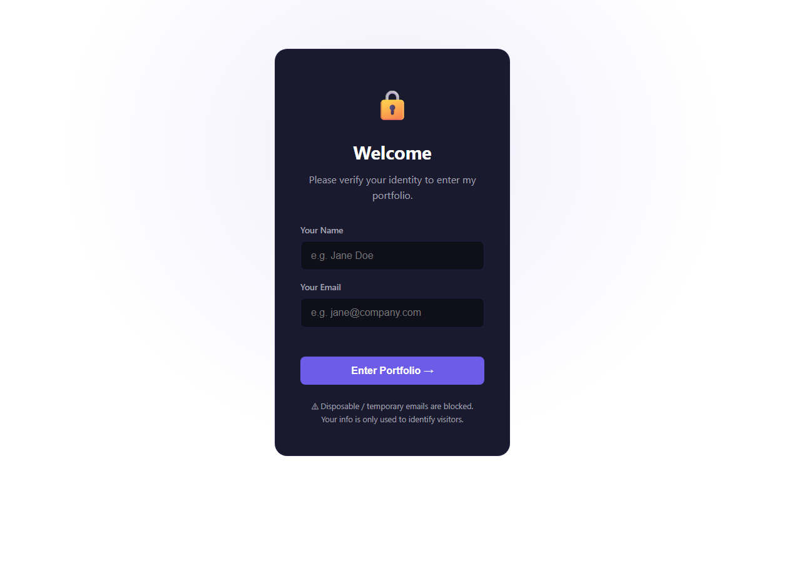
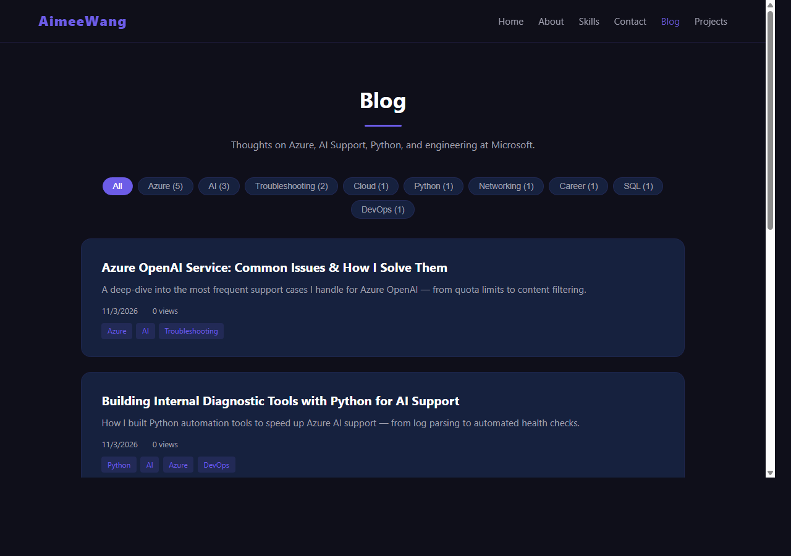

# Aimee's Portfolio Website

A full-stack personal portfolio website with admin dashboard, visitor analytics, blog CMS, GitHub project showcase, click tracking, contact form, and email notifications.

**Live Site:** https://aimeelan.azurewebsites.net

## Screenshots

| Visitor Verification | Blog |
|:---:|:---:|
|  |  |

| GitHub Projects | Admin Dashboard |
|:---:|:---:|
|  |  |

## Tech Stack

| Layer | Technology | Purpose |
|-------|-----------|---------|
| Backend | Python Flask | Web framework, API routes, session management |
| Database | Azure PostgreSQL Flexible Server | Persistent data: visitors, analytics, blog posts, projects |
| Cache | Azure Cache for Redis | Cache stats, blog posts, reduce DB queries |
| Frontend | HTML / CSS / JavaScript | Dark-theme portfolio UI with Chart.js dashboards |
| Hosting | Azure App Service (Linux) | Production hosting with managed SSL |
| CI/CD | GitHub Actions | Auto build & deploy on `git push` |
| Email | Gmail SMTP | Notify site owner when visitors send messages |
| External API | GitHub REST API v3 | Sync repos for project showcase |

## Project Structure

```
my-website/
├── app.py                       # Main Flask backend — 971 lines, 22 API routes, DB, Redis, auth, email
├── seed_data.py                 # 5 blog posts in Markdown — auto-loaded on first startup
├── requirements.txt             # Python deps: Flask, psycopg2, redis, gunicorn, bcrypt
├── .env.example                 # Template for all 12 environment variables
├── .gitignore                   # Ignores .env, __pycache__, .pyc, venv, logs, test artifacts
├── LICENSE                      # MIT License
├── README.md
├── static/                      # Frontend — Flask serves HTML/CSS/JS from here
│   ├── verify.html              # Landing page: name + email form, disposable email blocking
│   ├── index.html               # Portfolio page: hero, about, skills, experience, contact form
│   ├── blog.html                # Blog listing: tag filter sidebar, pagination, post cards
│   ├── post.html                # Single post: Markdown rendering (marked.js), code highlighting
│   ├── projects.html            # GitHub repos: cards with language, stars, forks, demo links
│   ├── admin.html               # Admin dashboard: login form, KPIs, charts, Redis panel, tables
│   ├── style.css                # Dark theme (#1a1a2e), purple accents, responsive grid, animations
│   └── script.js                # Client-side: click tracking, pageview API calls, scroll animations
├── tests/                       # pytest test suite — run with: python -m pytest tests/ -v
│   └── test_app.py              # 50 tests across 7 classes — see detailed breakdown below
├── guides/                      # How-to guides — actionable step-by-step instructions
│   ├── HOW_TO_DEPLOY.md         # Run locally, deploy to Railway, Render, Azure, or any VPS
│   ├── AZURE_SETUP_GUIDE.md     # Create Resource Group → VNet → PostgreSQL → Redis → App Service
│   ├── DEPLOYMENT.md            # GitHub Actions YAML walkthrough, build triggers, deploy steps
│   ├── BACKUP_AND_MIGRATION.md  # Export DB, back up env vars, migrate to new platform
│   └── TROUBLESHOOTING.md       # Container timeout, Redis auth, PG password, startup command fixes
├── reference/                   # Technical reference — how the system works internally
│   ├── ARCHITECTURE.md          # System diagram, 9 DB tables, security model, data flow
│   ├── FLASK.md                 # All 22 routes with method, path, auth, request/response details
│   ├── POSTGRESQL.md            # CREATE TABLE DDL, indexes, common queries, monitoring
│   ├── REDIS.md                 # 6 cache keys, TTL strategy, memory monitoring, failover behavior
│   └── STORY.md                 # Full narrative: from zero knowledge to production in one weekend
├── images/                      # Screenshots embedded in this README
│   ├── 01-verify.png            # Visitor verification page screenshot
│   ├── 02-blog.png              # Blog listing page screenshot
│   ├── 03-projects.png          # GitHub projects page screenshot
│   └── 04-admin.png             # Admin dashboard screenshot
└── .github/
    └── workflows/
        └── main_aimeelan.yml    # CI/CD: on push to main → build Python → deploy to Azure App Service
```

## Python Source Files — Detailed Breakdown

### `app.py` — Main Backend (971 lines)

The entire Flask backend in a single file. Contains all API routes, database operations, caching, authentication, and background tasks.

| Section | Lines | What It Does |
|---------|-------|-------------|
| Configuration | 24-36 | Flask app init, `SECRET_KEY`, admin credentials, SMTP config, GitHub settings |
| Connection String Parsers | 38-55 | `_parse_pg_conn()` — converts Azure semicolon-delimited PostgreSQL connection string to psycopg2 DSN format |
| Connection String Parsers | 57-88 | `_parse_redis_conn()` — extracts host, port, password, SSL from Azure Redis connection string |
| Redis Cache | 90-140 | Connects to Azure Redis on startup; `cache_get()`, `cache_set()`, `cache_delete()` helper functions |
| Database | 142-340 | `get_db()` — opens PostgreSQL connection; `init_db()` — creates all 9 tables on first run; `_seed_blog_posts()` — inserts 5 sample posts; `_seed_github_projects()` — syncs repos from GitHub API |
| Background Sync | 342-356 | `_github_sync_loop()` — daemon thread that syncs GitHub repos every 6 hours |
| Helpers | 358-406 | `is_valid_email()` — validates email + blocks disposable domains; `send_notification()` — sends email via SMTP; `require_verified` / `require_admin` — route decorators; `hash_ip()` — SHA-256 IP anonymization |
| Static Routes | 408-433 | Serves HTML pages: `/` (verify or index), `/blog`, `/blog/<slug>`, `/projects`, `/admin`, catch-all for CSS/JS |
| Visitor API | 435-465 | `POST /api/verify` — validates name + email, creates visitor record, sets session token |
| Pageview API | 466-505 | `POST /api/pageview` — records page view with referrer, user-agent, IP hash, screen width, duration |
| Click Tracking API | 506-525 | `POST /api/track` — logs click events (`data-track` attribute) with visitor ID and page |
| Contact API | 527-553 | `POST /api/contact` — saves message to DB + sends email notification to owner |
| Blog API | 555-674 | `GET /api/posts` — list posts with tag filter + pagination (cached); `GET /api/posts/<slug>` — single post (cached); `GET /api/tags` — tag list with counts (cached) |
| Projects API | 676-734 | `GET /api/projects` — list synced repos (cached); `POST /api/projects/sync` — trigger GitHub sync (admin only) |
| Admin Auth | 736-761 | `POST /api/admin/login` — bcrypt password check, session auth; `POST /api/admin/logout` |
| Admin Stats API | 763-873 | `GET /api/admin/stats` — full dashboard data: KPIs, Redis info (memory, keys, endpoints), charts (visitors/day, pageviews/day, top clicks, devices, email domains, top pages, top posts, recent messages) |
| Admin Visitors API | 874-907 | `GET /api/admin/visitors` — paginated visitor list with domain filtering |
| Admin Export API | 908-934 | `GET /api/admin/export/<table>` — CSV download for visitors, click_logs, messages, page_views |
| Admin Retention API | 935-968 | `GET /api/admin/retention` — cohort retention analysis (Day 0/1/7/30) using SQL CTEs |
| Run | 969-971 | `app.run()` — starts dev server on port 5000 |

### `seed_data.py` — Blog Seed Data (336 lines)

Contains the 5 initial blog posts loaded by `app.py` when the `posts` table is empty on first startup. Separated from `app.py` for cleaner code organization.

| Variable | What It Contains |
|----------|------------------|
| `SEED_POSTS` | List of 5 blog post dicts, each with: `slug`, `title`, `summary`, `content` (full Markdown with code examples), `tags` |

The 5 seed posts:
1. **From Answering Tickets to Building Tools** — Career growth narrative at Microsoft
2. **Azure Private Endpoints & VNet** — Networking concepts with diagrams
3. **Azure OpenAI Service Troubleshooting** — Common issues + diagnostic Python code
4. **Building Internal Diagnostic Tools with Python** — Real tool examples with code
5. **PostgreSQL Query Optimization** — Slow query analysis, EXPLAIN plans, indexing

Also contains embedded Python code examples (a diagnostic function `check_openai_resource()` and log analysis function `analyze_error_patterns()`) that appear as code blocks within blog post content.

### `tests/test_app.py` — Unit Tests (341 lines, 50 tests)

Comprehensive test suite using `unittest` + `pytest`. Patches the database on import so tests run without a real PostgreSQL connection.

| Test Class | Tests | What It Covers |
|------------|-------|---------------|
| `TestEmailValidation` | 12 | Valid emails, invalid formats, disposable domains (mailinator, guerrillamail, etc.) |
| `TestHashIp` | 5 | SHA-256 IP hashing, consistency, uniqueness, IPv6 support |
| `TestConnectionParsers` | 8 | Azure PostgreSQL + Redis connection string parsing, edge cases, malformed input |
| `TestCacheHelpers` | 8 | `cache_get`/`cache_set`/`cache_delete` with Redis connected and disconnected |
| `TestSeedData` | 6 | Seed post integrity — required fields, unique slugs, tag format, content length |
| `TestFlaskRoutes` | 8 | HTTP routes return correct status codes and content types (HTML pages, API endpoints, admin auth) |
| `TestPageviewAPI` | 3 | Pageview tracking API — valid submission, missing fields, session handling |

Run with: `python -m pytest tests/ -v`

---

## Features

### Core
- **Visitor Verification** — Visitors must enter name + email before viewing the portfolio
- **Anti-Phishing** — Disposable/temporary email domains are blocked
- **Click Tracking** — Every `data-track` click is logged with visitor ID and page
- **Contact Form** — Messages saved to DB + email notification to owner

### Admin Dashboard (`/admin`)
- **Secure Login** — bcrypt password hashing, session-based auth
- **KPI Cards** — Visitors, page views, clicks, messages, blog post counts, Redis cache status
- **Redis Cache Panel** — Live connection status, memory usage, peak memory, total cached keys, and a table of all 6 cached endpoints with key patterns, TTLs, and descriptions
- **Charts** — Visitors/day, pageviews/day, top clicks, device breakdown, email domains, top pages (Chart.js)
- **Visitor List** — Pagination, domain filtering
- **Retention Cohorts** — Day 0/1/7/30 retention analysis with SQL CTEs
- **CSV Export** — Download visitors, clicks, messages, page views as CSV
- **GitHub Sync** — One-click sync of repos from GitHub API

### Visitor Analytics
- **Page View Tracking** — Page, referrer, user-agent, IP hash, screen width, duration
- **Session Management** — Tracks visitor sessions with page count and timestamps
- **Device Classification** — Mobile / Tablet / Desktop based on screen width

### Blog CMS (`/blog`)
- **5 Seed Posts** — Azure AI Support, Python diagnostic tools, PostgreSQL optimization, Azure networking, career growth
- **Markdown Rendering** — Using marked.js with highlight.js code syntax highlighting
- **Tag Filtering** — Filter posts by tags (Azure, AI, Python, SQL, etc.)
- **Pagination** — Server-side pagination with configurable page size
- **View Counter** — Auto-increments on each post view

### GitHub Projects (`/projects`)
- **GitHub API Integration** — Sync repos via `/api/projects/sync`
- **Project Cards** — Name, description, language, stars, forks, issues
- **Featured Projects** — Highlight featured repos
- **Live Demo Links** — Shows homepage URL if set on GitHub

## API Endpoints

| Method | Path | Auth | Description |
|--------|------|------|-------------|
| GET | `/` | — | Serves verify.html or index.html based on session |
| GET | `/blog` | — | Blog listing page |
| GET | `/blog/<slug>` | — | Individual blog post page |
| GET | `/projects` | — | GitHub projects showcase page |
| GET | `/admin` | — | Admin dashboard page |
| POST | `/api/verify` | — | Verify visitor (name + email) |
| POST | `/api/pageview` | — | Record a page view with analytics data |
| POST | `/api/track` | Verified | Log a click event |
| POST | `/api/contact` | Verified | Send a message to site owner |
| GET | `/api/posts` | — | List blog posts (supports `?tag=`, `?page=`, `?per_page=`) |
| GET | `/api/posts/<slug>` | — | Get single post with full Markdown content |
| GET | `/api/tags` | — | List all tags with post counts |
| GET | `/api/projects` | — | List all synced GitHub projects |
| POST | `/api/projects/sync` | Admin | Sync repos from GitHub API |
| POST | `/api/admin/login` | — | Admin login (bcrypt) |
| POST | `/api/admin/logout` | — | Admin logout |
| GET | `/api/admin/stats` | Admin | Full analytics dashboard data + Redis server info |
| GET | `/api/admin/visitors` | Admin | Paginated visitor list with domain filter |
| GET | `/api/admin/export/<table>` | Admin | CSV export (visitors, click_logs, messages, page_views) |
| GET | `/api/admin/retention` | Admin | Retention cohort analysis |

## Database Tables

| Table | Purpose |
|-------|---------|
| `visitors` | Verified visitors (name, email, token) |
| `click_logs` | Click tracking events |
| `messages` | Contact form messages |
| `page_views` | Page view analytics (page, referrer, UA, IP hash, duration, screen width) |
| `visitor_sessions` | Session lifecycle (start, end, page count) |
| `posts` | Blog posts (slug, title, summary, Markdown content, views) |
| `tags` | Blog tags |
| `post_tags` | Many-to-many: posts ↔ tags |
| `projects` | GitHub repos (name, description, language, stars, forks, featured) |

## Quick Start (Local Development)

```bash
# 1. Clone
git clone https://github.com/hahAI111/aimeewebpage.git
cd aimeewebpage

# 2. Copy environment template and edit
cp .env.example .env
# Edit .env with your PostgreSQL connection string (at minimum)

# 3. Install dependencies
pip install -r requirements.txt

# 4. Run (uses local PostgreSQL by default)
python app.py
# → http://localhost:5000
```

## Running Tests

```bash
pip install pytest
python -m pytest tests/ -v
```

50 tests covering: email validation, IP hashing, connection string parsing, cache helpers, seed data integrity, Flask routes, auth, and pageview tracking.

## Environment Variables

| Variable | Description |
|----------|-------------|
| `AZURE_POSTGRESQL_CONNECTIONSTRING` | PostgreSQL connection string |
| `AZURE_REDIS_CONNECTIONSTRING` | Redis connection string (optional — app works without it) |
| `OWNER_EMAIL` | Email to receive contact notifications |
| `SMTP_SERVER` / `SMTP_PORT` / `SMTP_USER` / `SMTP_PASS` | Gmail SMTP config |
| `SECRET_KEY` | Flask session encryption key |
| `ADMIN_USER` | Admin username (default: `admin`) |
| `ADMIN_PASS` or `ADMIN_PASS_HASH` | Admin password (plain or bcrypt hash) |
| `GITHUB_USERNAME` | GitHub user for project sync (default: `hahAI111`) |
| `GITHUB_TOKEN` | GitHub personal access token (optional, raises API rate limit) |
| `GITHUB_SYNC_INTERVAL` | Auto-sync interval in seconds (default: `21600` = 6 hours) |

## Deployment

Code is auto-deployed via GitHub Actions. Just push to `main`:

```bash
git add -A
git commit -m "your change"
git push
```

GitHub Actions will build and deploy to Azure App Service automatically.

## How to Use

### Visitor Flow

1. Open https://aimeelan.azurewebsites.net
2. Enter your **name** and **email** on the verification page
3. After verification, browse the portfolio, blog, and projects pages
4. Use the **Contact** form at the bottom to send a message

### Admin Dashboard

1. Open https://aimeelan.azurewebsites.net/admin
2. Login with admin credentials (set via `ADMIN_USER` / `ADMIN_PASS` env vars)
3. The dashboard shows:
   - **KPI Cards** — Total visitors, page views, clicks, messages, blog posts
   - **Redis Cache KPI** — Shows ✅ Connected (green) or ❌ Not Connected (gray) at a glance
   - **Charts** — Visitors per day, pageviews per day, top clicked elements, device types, email domains
   - **Top Pages & Posts** — Most viewed pages and blog posts
   - **Recent Messages** — Latest messages from the contact form
   - **Visitor List** — Paginated table with domain filtering
   - **Retention Cohorts** — Day 0/1/7/30 visitor retention analysis
4. **CSV Export** — Click "Export" buttons to download visitors, clicks, messages, or pageviews as CSV
5. **GitHub Sync** — Click "Sync Projects" to pull latest repos from GitHub API

### Admin — Redis Cache Panel

When Redis is connected, a **Redis Cache Status** panel appears below the KPI cards showing:

| Metric | Description |
|--------|-------------|
| **Status** | ✅ Connected (green) or ❌ Not Connected (gray) |
| **Memory Used** | Current Redis memory consumption (e.g. `357.72K`) |
| **Peak Memory** | Highest memory usage since Redis started (e.g. `559.67K`) |
| **Total Keys** | Number of active cached keys in Redis |

Below the metrics is a **Cached Endpoints** table listing all 6 cache keys:

| Key Pattern | TTL | What It Caches |
|-------------|-----|----------------|
| `stats:overview` | 60s | Admin dashboard KPIs & charts |
| `stats:retention` | 300s | Retention cohort analysis |
| `posts:list:*` | 120s | Blog listing with tag/page |
| `post:<slug>` | 300s | Single blog post content |
| `tags:all` | 300s | Tag list with counts |
| `projects:all` | 300s | GitHub projects list |

**How it works:** The app caches expensive database queries in Redis with TTLs. When a cached key exists, the response is served from Redis (fast) instead of hitting PostgreSQL. Keys auto-expire after their TTL, so data stays fresh. If Redis is down, the app falls back to direct DB queries — everything still works, just slower.

### Blog

- Browse posts at `/blog`, filter by tags (Azure, Python, AI, SQL, etc.)
- Each post supports Markdown rendering with syntax-highlighted code blocks
- View counts auto-increment on each visit

### GitHub Projects

- View synced repos at `/projects`
- Projects sync automatically every 6 hours, or manually via admin "Sync Projects"

## Azure Infrastructure

| Resource | Service | Details |
|----------|---------|---------|
| App Service | `aimeelan` | Linux Python 3.14, Canada Central |
| PostgreSQL | `aimeelan-server` | Flexible Server v14, 1 vCore Burstable |
| Redis | `aimee-cache` | Basic C0, Redis 6.0, SSL port 6380 |
| VNet | Private networking | App Service, PostgreSQL, Redis on private subnets |
| CI/CD | GitHub Actions | Auto-deploy on push to `main` |

### Key App Settings

| Setting | Purpose |
|---------|---------|
| `AZURE_POSTGRESQL_CONNECTIONSTRING` | Database connection (set as Connection String, not App Setting) |
| `AZURE_REDIS_CONNECTIONSTRING` | Redis connection with password and SSL |
| `WEBSITES_CONTAINER_START_TIME_LIMIT` | Set to `600` (cert updates take ~3 min on startup) |
| `WEBSITE_VNET_ROUTE_ALL` | `1` — routes all traffic through VNet |
| `WEBSITE_DNS_SERVER` | `168.63.129.16` — Azure internal DNS for private endpoints |

## Documentation

### [`guides/`](guides/) — How-To Guides (step-by-step instructions)

| Document | What It Teaches You |
|----------|--------------------|
| [HOW_TO_DEPLOY.md](guides/HOW_TO_DEPLOY.md) | 5 ways to run & deploy: local dev, Railway, Render, Azure App Service, any VPS |
| [AZURE_SETUP_GUIDE.md](guides/AZURE_SETUP_GUIDE.md) | Create every Azure resource from scratch: Resource Group → VNet → PostgreSQL → Redis → App Service → CI/CD |
| [DEPLOYMENT.md](guides/DEPLOYMENT.md) | How the GitHub Actions CI/CD pipeline works: YAML config, build steps, deploy triggers |
| [BACKUP_AND_MIGRATION.md](guides/BACKUP_AND_MIGRATION.md) | What to back up before you lose access, how to migrate to a new platform |
| [TROUBLESHOOTING.md](guides/TROUBLESHOOTING.md) | Every issue hit during development + exact fix commands |

### [`reference/`](reference/) — Technical Reference (how the system works)

| Document | What It Explains |
|----------|------------------|
| [ARCHITECTURE.md](reference/ARCHITECTURE.md) | System design, DB schema (9 tables), security model, data flow diagrams |
| [FLASK.md](reference/FLASK.md) | All 22 API routes, auth decorators, request lifecycle, middleware |
| [POSTGRESQL.md](reference/POSTGRESQL.md) | Database schema, SQL operations, indexing, monitoring queries |
| [REDIS.md](reference/REDIS.md) | Cache strategy, 6 cached endpoints, TTL design, Azure Redis config |
| [STORY.md](reference/STORY.md) | Full project narrative: from zero knowledge to production deployment |

## Production Incident Log (March 2026)

The admin dashboard showed Redis as "Not Connected". During the fix, a chain of cascading issues occurred. Below is the full troubleshooting timeline and resolution.

### Issue 1: Redis Not Connected

**Symptom:** Admin panel Redis Cache status showed ❌ Not Connected

**Root Cause:** Azure Redis had `disableAccessKeyAuthentication` set to `true`, which disabled password-based auth. The app connects with a password and was rejected.

**Fix:**
```bash
az redis update --name aimee-cache --resource-group aimee-test-env \
  --set disableAccessKeyAuthentication=false
```

### Issue 2: Startup Command Corrupted During Redis Fix

**Symptom:** Site completely inaccessible, container crash-looping (exit code 127)

**Root Cause:** Startup command was accidentally changed to `startup.sh` (file does not exist). The correct command is gunicorn.

**Fix:**
```bash
az webapp config set --name aimeelan --resource-group aimee-test-env \
  --startup-file "gunicorn --bind=0.0.0.0:8000 --timeout 600 app:app"
```

### Issue 3: Container Startup Timeout (230s)

**Symptom:** Docker logs showed `Container did not start within expected time limit of 230s`

**Root Cause:** Azure App Service Linux containers run `update-ca-certificates` on startup, which takes ~2.5-3 minutes. This exceeds the default 230-second timeout.

**Fix:**
```bash
az webapp config appsettings set --name aimeelan --resource-group aimee-test-env \
  --settings WEBSITES_CONTAINER_START_TIME_LIMIT=600
```

### Issue 4: PostgreSQL Password Authentication Failed

**Symptom:** Homepage returned HTTP 200, but `/api/admin/stats` returned 500. Logs showed `FATAL: password authentication failed for user "prjxaadsjr"`

**Root Cause:** The old password contained the `$` special character, which was corrupted during environment variable passing across shells.

**Fix:**
```bash
# 1. Reset PostgreSQL password
az postgres flexible-server update --name aimeelan-server \
  --resource-group aimee-test-env --admin-password "Aimee2026Pg!"

# 2. Update App Service connection string
az webapp config connection-string set --name aimeelan \
  --resource-group aimee-test-env -t Custom \
  --settings "AZURE_POSTGRESQL_CONNECTIONSTRING=Database=aimeelan-database;Server=aimeelan-server.postgres.database.azure.com;User Id=prjxaadsjr;Password=Aimee2026Pg!"
```

### Final Status

| Component | Status |
|-----------|--------|
| Website (HTTP 200) | ✅ OK |
| Redis (Admin Panel) | ✅ Connected |
| PostgreSQL | ✅ Auth OK |
| Admin Stats API | ✅ Full data returned |
| Container Startup | ✅ ~280s |

### Lessons Learned

1. **Never change multiple production configs at once** — change one, verify, then move to the next
2. **Azure Redis `disableAccessKeyAuthentication` may revert to `true` via Azure Policy** — check subscription-level policies
3. **Avoid `$` and other shell special characters in passwords** — they get corrupted when passed through environment variables, connection strings, and PowerShell
4. **Set container startup timeout to 600s** — Azure Linux container cert updates are a fixed overhead; the default 230s is not enough
